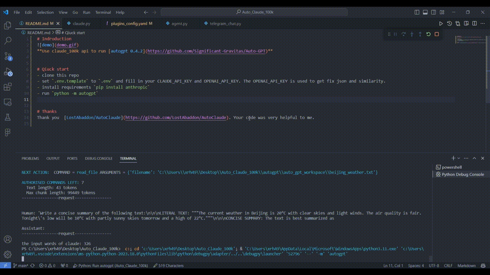

# Indroduction

Use claude_100k api to run [autogpt 0.3.1](https://github.com/Significant-Gravitas/Auto-GPT)

# Qiuck start
1. clone this repo
2. install requirements `pip install anthropic`
3. set `.env.template` to `.env` and fill in your claude_100k api key
4. run `python -m autogpt`

# Thanks
Thank [LostAbaddon/AutoClaude](https://github.com/LostAbaddon/AutoClaude),I use your code to change autogpt 0.3.1.Your code very help me.
